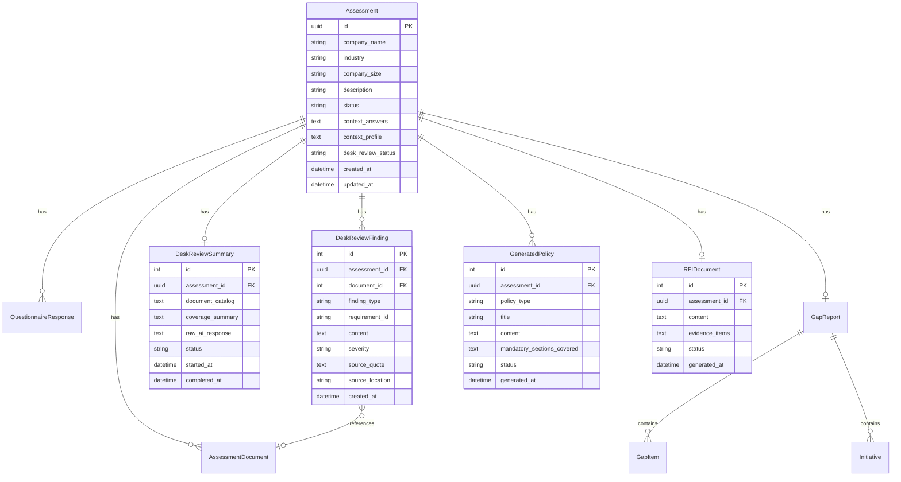

# feat: Intelligent Audit Assistant

## Overview

Evolve CyberAssess from a static questionnaire into an intelligent audit assistant that mirrors how a seasoned auditor works: review documents first, arrive with hypotheses, ask pointed questions, probe deeper when answers don't add up, and generate targeted evidence requests.

This is the largest architectural change since v1. It introduces a new three-phase assessment flow (Desk Review -> Adaptive Assessment -> Outputs), a web portal replacing Excel-based input, and three new output types (RFI document, generated policies, enhanced gap report).

**Origin document:** [docs/brainstorms/2026-04-04-intelligent-audit-assistant-requirements.md](../brainstorms/2026-04-04-intelligent-audit-assistant-requirements.md)

## Problem Statement

The current tool operates as a structured-but-static assessment. Clients answer a fixed questionnaire, upload documents, and receive a gap report. While the two-phase questionnaire (context gathering -> adaptive sections) adds some intelligence, it still feels like a form. A seasoned auditor reviews documents first, arrives with hypotheses, and asks pointed questions based on findings. The tool should replicate this workflow. Additionally, Excel-based input needs to be replaced with a professional web portal. (see origin)

## Key Decisions Carried Forward

1. **Evidence intelligence before questionnaire** — documents analyzed first, findings shape the questionnaire (see origin: Key Decisions)
2. **Levels 1-3 for evidence intelligence** — cross-referencing, absence detection, signal detection. Level 4 (contextual inference) deferred (see origin: Scope Boundaries)
3. **Formal RFI as standalone output** — client-ready document, not just a report section (see origin: R9)
4. **Hybrid policy generation** — template structure + AI content ensures mandatory clauses aren't missed while providing org-specific customization (see origin: R10-R12)
5. **Jinja2 + HTMX + Tailwind CSS** within FastAPI repo — server-rendered, minimal attack surface, HTMX for dynamic questionnaire flow (see origin: Resolved questions)
6. **1 industry vertical (IT/SaaS) + generic bank** for v1 (see origin: Resolved questions)
7. **DPDPA only** but extensible architecture. No compliance monitoring over time (see origin: Scope Boundaries)

---

## Technical Approach

### Architecture Overview

```
                          ┌─────────────────────────────┐
                          │      Web Portal (new)        │
                          │  Jinja2 + HTMX + Tailwind    │
                          └──────────┬──────────────────┘
                                     │
                          ┌──────────▼──────────────────┐
                          │      FastAPI Backend          │
                          │  (existing + new routers)     │
                          └──────────┬──────────────────┘
                                     │
          ┌──────────────────────────┼──────────────────────────┐
          │                          │                          │
┌─────────▼──────────┐  ┌───────────▼──────────┐  ┌───────────▼──────────┐
│  Desk Review        │  │  Adaptive Assessment  │  │  Output Generation   │
│  Pipeline (new)     │  │  Engine (new)          │  │  (new + enhanced)    │
│                     │  │                        │  │                      │
│  - Document catalog │  │  - Dynamic questions   │  │  - Enhanced gap      │
│  - Evidence map     │  │  - Industry banks      │  │    report            │
│  - Absence detect   │  │  - Follow-up engine    │  │  - RFI document      │
│  - Signal detect    │  │  - Skip/deepen logic   │  │  - Policy generation │
└─────────┬──────────┘  └───────────┬──────────┘  └───────────┬──────────┘
          │                          │                          │
          └──────────────────────────┼──────────────────────────┘
                                     │
                          ┌──────────▼──────────────────┐
                          │   Claude API (Anthropic)      │
                          │   + Prompt Cache               │
                          └──────────┬──────────────────┘
                                     │
                          ┌──────────▼──────────────────┐
                          │   SQLite + SQLAlchemy         │
                          └───────────────────────────────┘
```

### Resolving Deferred Technical Questions

**Q: How should desk review integrate with the existing two-call Claude pipeline?**

**A: Add a pre-analysis call. Don't restructure.**

The existing two-call pattern (evidence extraction -> gap analysis) is proven and uses prompt caching. The desk review becomes **Call 0** — a new pre-analysis Claude call that runs on document upload, before the questionnaire begins. Its output (evidence map, findings, flags) feeds into both the adaptive questionnaire engine AND the existing Call 1 + Call 2 pipeline.

```
NEW PIPELINE:
  Call 0: Desk Review Analysis (on document upload)
     → evidence_map, absence_findings, signal_flags, document_catalog
  
  [Questionnaire happens here, shaped by Call 0 output]
  
  Call 1: Evidence Extraction (existing, enhanced with desk review context)
     → evidence quotes per requirement
  
  Call 2: Gap Analysis (existing, enhanced with desk review + questionnaire)
     → 41 gap assessments
```

This preserves backward compatibility — assessments without documents skip Call 0 and work exactly as they do today.

**Q: Dynamic question generation architecture?**

**A: Hybrid — pre-defined branching trees with LLM-generated follow-ups.**

- **Base questions**: Pre-defined per industry vertical in Python dicts (same pattern as `framework.py`). Each question has skip conditions, deepen conditions, and follow-up triggers — all based on desk review findings.
- **Follow-up questions**: LLM-generated when a base question answer triggers a probe. Claude receives the question, answer, desk review context, and generates 1-2 targeted follow-ups.
- **Why hybrid**: Pure branching trees can't handle the combinatorial explosion of desk review findings x questionnaire answers. Pure LLM generation risks missing critical compliance questions. The hybrid gives structure where it matters (every DPDPA requirement gets asked about) and intelligence where it adds value (probing inconsistencies).

**Q: RFI document format?**

**A: PDF initially, DOCX as a fast-follow.**

PDF is already supported via fpdf2. DOCX adds `python-docx` (already a dependency for document extraction). Start with PDF to reuse existing infrastructure, add DOCX export in the same phase since the library is already available.

**Q: Authentication and multi-tenancy?**

**A: Simple session-based auth. No multi-tenancy in v1.**

- Cookie-based sessions via `starlette.middleware.sessions.SessionMiddleware`
- Single auditor user (hardcoded or env-based credentials for v1)
- Assessment isolation by `assessment_id` (already exists)
- Multi-tenancy is a future concern when/if the tool moves to SaaS

---

## Implementation Phases

### Phase 1: Web Portal Foundation (No AI Changes)

**Goal:** Replace Excel with a functional web interface that drives the existing API. Zero AI changes — this is pure frontend + routing.

**Why first:** Every subsequent phase needs a UI to be testable and demonstrable. Building the portal on the existing API means we can ship a usable improvement immediately.

**Deliverables:**

#### 1a. Project Setup & Base Layout
- [x] Add dependencies: `jinja2`, `itsdangerous` to `requirements.txt`
- [x] Create template directory structure:
  ```
  app/
    templates/
      base.html           # Layout shell (nav, sidebar, Tailwind CDN, HTMX)
      pages/
        login.html
        dashboard.html     # Assessment list
        assessment.html    # Single assessment view (tabbed: docs, questionnaire, report)
        new_assessment.html
      partials/            # HTMX fragments
        assessment_row.html
        document_list.html
        upload_status.html
        question_step.html
        question_followup.html
        report_summary.html
      components/          # Jinja2 macros
        form_field.html
        status_badge.html
        progress_bar.html
    static/
      css/style.css        # Minimal custom CSS (Tailwind does most work)
      js/app.js            # HTMX config, upload progress handler
  ```
- [x] Configure `Jinja2Templates` in `app/main.py`
- [x] Mount static files: `app.mount("/static", StaticFiles(...))`
- [x] Add `SessionMiddleware` with env-configurable secret key
- [x] Create `app/routers/web.py` — HTML-serving routes (separate from API routes)
- [x] Base template: dark professional theme (navy/gray palette matching existing PDF brand), HTMX 2.0.4 via CDN, Tailwind CSS via CDN

#### 1b. Authentication
- [x] Simple login page (`/login`)
- [x] Hardcoded auditor credentials from env vars (`AUDITOR_USERNAME`, `AUDITOR_PASSWORD`)
- [x] Session-based auth via `SessionMiddleware`
- [x] `require_auth` dependency for web routes
- [x] HTMX-aware auth: `HX-Redirect` header on 401 for HTMX requests
- [x] Logout endpoint (`POST /logout`)

#### 1c. Dashboard & Assessment CRUD
- [x] Dashboard page (`GET /`) — list assessments with status badges, creation date, company name
- [x] New assessment form (`GET /assessments/new`, `POST /assessments/new`)
- [x] Assessment detail page (`GET /assessments/{id}`) — tabbed layout:
  - **Documents** tab — upload area, document list with categories
  - **Questionnaire** tab — context gathering + compliance questions
  - **Report** tab — gap report summary, PDF download link
- [x] Delete assessment (HTMX confirm + remove row)

#### 1d. Document Upload
- [x] Drag-and-drop upload zone with HTMX `multipart/form-data`
- [x] Upload progress bar via `htmx:xhr:progress` event
- [x] Document list with category badges and delete buttons
- [x] Category selection dropdown (privacy_policy, consent_form, etc.)
- [x] Poll for extraction status after upload (`hx-trigger="every 2s"` until complete)

#### 1e. Questionnaire Flow
- [x] Context gathering (Phase 1): multi-step wizard via HTMX
  - Render 4 blocks as sequential steps
  - `hx-post` submits answers, returns next step
  - Conditional questions (e.g., `CTX.DATA.4a` depends on `CTX.DATA.4`) via `hx-get` on change
  - Progress bar showing block/total
- [x] Compliance questionnaire (Phase 2): section-by-section flow
  - Section selector sidebar
  - 5-option GRC scale radio buttons per question
  - Notes/evidence fields (expandable)
  - Section completion indicators
- [x] "Run Analysis" button → triggers `/api/assessments/{id}/analyze`
  - Show loading state (15-30s Claude call)
  - Poll for completion or use HTMX `hx-trigger="every 3s"` on status endpoint
- [x] Report view: summary cards + link to PDF download

**Success criteria:** An auditor can create an assessment, upload documents, complete the full questionnaire, run analysis, and download the PDF report — all through the web portal with no API/curl calls needed.

**Estimated scope:** ~15 templates, 1 new router (`web.py`), ~10 new HTML-serving endpoints.

---

### Phase 2: Desk Review Pipeline (Core Intelligence)

**Goal:** Implement the document-first analysis that is the architectural heart of the intelligent audit assistant. When documents are uploaded, the tool analyzes them before the questionnaire begins.

**Why second:** This is the highest-value feature and the foundation that Phases 3-4 build on. It also has the cleanest boundary — it takes documents in and produces structured findings out, with no UI dependencies beyond Phase 1's upload flow.

**Deliverables:**

#### 2a. Desk Review Analysis Engine
- [x] New service: `app/services/desk_review.py`
  - `run_desk_review(assessment_id) -> DeskReviewResult`
  - Orchestrates Call 0 to Claude with all uploaded documents
  - Returns structured result:
    ```python
    @dataclass
    class DeskReviewResult:
        document_catalog: list[DocumentEntry]    # type, coverage, summary per doc
        evidence_map: dict[str, list[Evidence]]  # requirement_id -> evidence items
        absence_findings: list[AbsenceFinding]   # missing provisions per requirement
        signal_flags: list[SignalFlag]            # red flags with severity + explanation
        coverage_summary: dict[str, str]          # requirement_id -> coverage level
    ```

- [x] New prompt builder: `app/dpdpa/prompts.py` — `build_desk_review_prompt()`
  - System prompt: "You are a compliance document analyst specializing in India's DPDPA 2023..."
  - Includes full DPDPA requirements framework (with prompt cache)
  - Instructions for each analysis level:
    - **Catalog**: classify each document, identify what DPDPA areas it covers
    - **Evidence mapping**: extract specific provisions/clauses mapped to requirement IDs
    - **Absence detection (L2)**: for each requirement, identify what's missing from the documents
    - **Signal detection (L3)**: catch red flags — GDPR copy-paste, buried consent, missing DPDPA-specific timelines, inconsistent terminology
  - Output format: structured JSON matching `DeskReviewResult`

- [x] Prompt cache strategy: reuse the same cached system prompt block (DPDPA requirements) across Call 0, Call 1, and Call 2. All three calls share the same requirements text, so one cache entry serves all.

#### 2b. Database Changes
- [x] New model: `DeskReviewFinding` table
  ```
  id, assessment_id, finding_type (evidence|absence|signal),
  requirement_id (nullable — signals may be cross-cutting),
  document_id (FK to assessment_documents),
  content (the finding text),
  severity (info|low|medium|high|critical),
  source_quote (exact text from document),
  source_location (page/section reference),
  created_at
  ```
- [x] New model: `DeskReviewSummary` table
  ```
  id, assessment_id (unique),
  document_catalog (JSON text),
  coverage_summary (JSON text),
  raw_ai_response (text),
  status (pending|analyzing|completed|error),
  started_at, completed_at
  ```
- [x] Add `desk_review_status` field to `Assessment` model
- [x] Add SQLAlchemy `relationship()` declarations to existing models (overdue cleanup — enables cascade deletes and eager loading)

#### 2c. API & Trigger
- [x] New endpoint: `POST /api/assessments/{id}/desk-review` — triggers desk review analysis
- [x] New endpoint: `GET /api/assessments/{id}/desk-review` — returns findings + status
- [x] New endpoint: `GET /api/assessments/{id}/desk-review/status` — lightweight status check for polling
- [x] Auto-trigger: option to run desk review automatically when documents are uploaded (configurable)
- [x] Update analysis endpoint to incorporate desk review findings into Call 1 + Call 2

#### 2d. Web Portal Integration
- [x] After document upload, show "Run Desk Review" button (or auto-trigger)
- [x] Desk review progress indicator (analyzing -> complete)
- [x] Findings display panel on the Documents tab:
  - Evidence map: requirement -> evidence items with source quotes
  - Absence findings: what's missing, grouped by chapter
  - Signal flags: red flag cards with severity badges
  - Coverage heatmap: which requirements have document evidence, which don't
- [x] Transition prompt: "Desk review complete. X findings across Y documents. Proceed to questionnaire?"

#### 2e. Pipeline Integration
- [x] Modify `build_evidence_extraction_prompt()` (Call 1) to include desk review findings as context
- [x] Modify `build_user_prompt()` (Call 2) to include desk review coverage summary
- [x] Desk review findings feed into the gap report's `evidence_quote` field
- [x] Update PDF report to include a "Document Analysis Summary" section (appendix)

**Success criteria:** Upload a privacy policy -> desk review identifies specific DPDPA gaps (e.g., "no mention of consent withdrawal mechanism", "references GDPR legitimate interest") -> these findings appear in the UI before the questionnaire begins.

**Key invariant:** Deterministic scoring remains in `scoring.py`. Desk review findings are qualitative context for Claude, not scoring inputs.

---

### Phase 3: Adaptive Assessment Engine

**Goal:** Transform the static questionnaire into an evidence-informed, industry-aware, conversational assessment.

**Why third:** Depends on Phase 2's desk review findings to shape questions. The questionnaire skeleton from Phase 1 provides the UI foundation.

**Deliverables:**

#### 3a. Industry-Specific Question Banks
- [x] New module: `app/dpdpa/industry_questions.py`
  - Data structure (Python dicts, same pattern as `framework.py`):
    ```python
    INDUSTRY_QUESTIONS = {
        "it_saas": {
            "name": "IT / SaaS",
            "questions": [
                {
                    "id": "IND.SAAS.1",
                    "text": "How do you handle data deletion requests...",
                    "maps_to": ["CH3.ACCESS.1", "CH2.MINIMIZE.2"],
                    "skip_if": {"desk_review_coverage": ["CH3.ACCESS.1"]},
                    "deepen_if": {"signal_flags": ["gdpr_copy_paste"]},
                    "follow_up_triggers": {...},
                },
                ...
            ]
        },
        "generic": {
            "name": "Generic",
            "questions": [...]
        }
    }
    ```
  - IT/SaaS vertical: questions about SaaS data flows, API data sharing, cloud infrastructure, SLA-based deletion, multi-tenant data isolation, third-party integrations
  - Generic bank: core DPDPA questions that apply regardless of industry
  - Each question maps to 1+ requirement IDs (for scoring/reporting)

- [x] Question selection logic: `app/services/question_engine.py`
  - `build_adaptive_questionnaire(assessment_id) -> list[QuestionSet]`
  - Inputs: desk review findings, context profile (risk tier, industry), org profile
  - Logic:
    1. Start with industry-specific bank (or generic if industry not matched)
    2. **Skip** questions where desk review found strong evidence (coverage >= "adequate")
    3. **Deepen** questions where desk review found signals/absences (add follow-up probes)
    4. **Add** targeted questions for any signal flags (e.g., GDPR copy-paste -> ask about DPDPA-specific adaptations)
    5. Ensure every DPDPA requirement is covered by at least one question (no gaps in coverage)

#### 3b. Conversational Follow-ups
- [x] Follow-up generation service: `app/services/followup_engine.py`
  - When an answer triggers a probe (based on `follow_up_triggers` or inconsistency with desk review):
    1. Send to Claude: the question, the answer, the desk review context for mapped requirements
    2. Claude returns 1-2 targeted follow-up questions
    3. Follow-ups displayed inline via HTMX (append to current question)
  - Rate limit: max 2 follow-ups per base question (prevent infinite drilling)
  - Follow-up answers stored with parent question reference

- [x] Inconsistency detection (real-time, during questionnaire):
  - Compare answer to desk review evidence for the same requirement
  - If contradiction detected: auto-trigger follow-up
  - Example: Q asks about breach notification, answer says "yes we have it", desk review found no breach notification in any document -> follow-up: "Your uploaded documents don't mention breach notification procedures. Can you point us to the specific document or describe your current process?"

#### 3c. Web Portal — Adaptive Questionnaire UI
- [x] Update `question_step.html` partial:
  - Show desk review context per question ("Based on your privacy policy, we found...")
  - Inline follow-up questions (HTMX append)
  - Skip indicators ("Skipped — covered by document evidence")
  - Evidence links (click to see source quote from desk review)
- [x] Questionnaire progress now reflects adaptive length (not fixed 41 questions)
- [x] "AI is thinking..." indicator for follow-up generation (1-3s Claude call)

#### 3d. Integration with Analysis Pipeline
- [x] Adaptive questionnaire responses feed into Call 2 (gap analysis) alongside desk review findings
- [x] Follow-up Q&A pairs included in the prompt as additional context
- [x] Answer confidence signals ("strong evidence" vs "self-reported") passed to Claude

**Success criteria:** An IT/SaaS company assessment asks fundamentally different questions than a generic assessment. Questions about areas with strong document evidence are skipped. When an answer contradicts document findings, a targeted follow-up appears.

---

### Phase 4: Output Generation (RFI + Policies + Enhanced Report)

**Goal:** Generate the three output types that make this tool client-ready: formal RFI, generated policies, and an enhanced gap report.

**Why fourth:** Depends on Phase 2 (desk review findings) and Phase 3 (questionnaire responses) to have rich input data. The gap report enhancement is incremental on the existing PDF.

**Deliverables:**

#### 4a. RFI Document Generation
- [x] New service: `app/services/rfi_generator.py`
  - `generate_rfi(assessment_id) -> RFIDocument`
  - Inputs: desk review findings (absences + gaps), questionnaire responses (weak areas), gap report
  - Output structure:
    ```
    RFI Document:
      - Header (client name, date, assessment reference)
      - Introduction (purpose, DPDPA context)
      - Evidence Items (grouped by DPDPA chapter):
        - Item ID, Description, DPDPA Requirement Reference
        - Priority (Critical / High / Medium)
        - Current Status ("Not found in submitted documents" / "Partially addressed in [doc]")
        - Suggested Deadline
      - Response Instructions
      - Appendix: DPDPA requirement summary
    ```
  - Claude call: takes gap items + desk review absences, generates professional RFI prose
  - Template enforcement: mandatory sections ensured by code, not just prompt

- [x] PDF export: extend `pdf_export.py` with RFI-specific layout
  - Professional letterhead style (different from gap report)
  - Table format for evidence items
  - All text through `S()` sanitizer
- [x] DOCX export: new `app/utils/docx_export.py`
  - Uses `python-docx` (already a dependency)
  - Same content as PDF but in editable format
  - Professional styling (heading styles, table formatting)

- [x] API endpoints:
  - `POST /api/assessments/{id}/rfi/generate`
  - `GET /api/assessments/{id}/rfi` (JSON)
  - `GET /api/assessments/{id}/rfi/pdf`
  - `GET /api/assessments/{id}/rfi/docx`

#### 4b. Policy Generation
- [ ] New module: `app/dpdpa/policy_templates.py`
  - Template definitions for each policy type:
    ```python
    POLICY_TEMPLATES = {
        "privacy_policy": {
            "title": "Privacy Policy",
            "mandatory_sections": [
                {"id": "PP.1", "title": "Purpose and Scope", "dpdpa_ref": "Section 5"},
                {"id": "PP.2", "title": "Data Collection and Processing", "dpdpa_ref": "Section 4"},
                {"id": "PP.3", "title": "Consent Mechanisms", "dpdpa_ref": "Section 6"},
                {"id": "PP.4", "title": "Data Principal Rights", "dpdpa_ref": "Chapter III"},
                ...
            ],
            "mandatory_clauses": [...],  # DPDPA provisions that MUST appear
            "applicability": "always",   # vs conditional on SDF status etc.
        },
        "consent_management_policy": {...},
        "breach_notification_procedure": {...},
        "data_retention_policy": {...},
        # Role-specific (conditional):
        "dpia_template": {"applicability": "sdf_only", ...},
        "dpo_charter": {"applicability": "sdf_only", ...},
        "vendor_agreement": {"applicability": "has_processors", ...},
    }
    ```

- [ ] New service: `app/services/policy_generator.py`
  - `generate_policies(assessment_id) -> list[GeneratedPolicy]`
  - Determines which policies to generate based on assessment profile:
    - Core 4 always generated
    - Role-specific based on: SDF status, cross-border transfers, processor relationships
  - For each policy:
    1. Assemble template (mandatory sections + clauses)
    2. Claude call: "Fill this template with org-specific content" — provides org profile, industry, data types, identified gaps, desk review findings
    3. Validate output: check all mandatory sections present, all DPDPA clause references included
    4. Mark as "Draft — Requires Legal Review"

- [ ] Policy storage: `GeneratedPolicy` model
  ```
  id, assessment_id, policy_type, title, content (text),
  mandatory_sections_covered (JSON), status (draft|reviewed|approved),
  generated_at
  ```

- [ ] Export: PDF + DOCX per policy (reuse export infrastructure)

- [ ] API endpoints:
  - `POST /api/assessments/{id}/policies/generate`
  - `GET /api/assessments/{id}/policies`
  - `GET /api/assessments/{id}/policies/{policy_id}/pdf`
  - `GET /api/assessments/{id}/policies/{policy_id}/docx`

#### 4c. Enhanced Gap Report
- [x] Enrich gap report with evidence intelligence:
  - Each gap item now includes: desk review evidence (supporting/contradicting), absence findings, signal flags
  - "Evidence Confidence" indicator per gap: strong (document evidence), moderate (self-reported + partial docs), weak (self-reported only)
- [x] Update PDF report:
  - New section: "Document Analysis Summary" (after executive dashboard)
  - Evidence confidence badges on gap cards
  - Signal flags highlighted in gap descriptions
- [x] Enhanced executive summary prompt: include desk review findings so Claude produces more specific, evidence-backed narrative

#### 4d. Web Portal — Outputs UI
- [x] Report tab redesign:
  - Summary dashboard (existing)
  - Gap report section with evidence confidence indicators
  - RFI section: preview + PDF/DOCX download buttons
  - Policies section: list of generated policies with status badges, preview, download
- [x] "Generate All Outputs" button — runs gap analysis + RFI + policies in sequence
- [x] Individual regeneration buttons per output type

**Success criteria:**
- RFI document is professional enough to send to a client without editing (see origin: Success Criteria)
- Generated policies contain correct DPDPA structure and org-specific substance, requiring only legal review (see origin: Success Criteria)
- Gap report shows evidence confidence — "this gap is backed by document analysis" vs "this is self-reported only"

---

## ERD — New and Modified Models



---

## System-Wide Impact

### Interaction Graph

- Document upload (`POST /documents`) now optionally triggers desk review (`run_desk_review()`) which calls Claude API (Call 0). Desk review findings persist to `DeskReviewFinding` table and influence `build_adaptive_questionnaire()`.
- Questionnaire submission (`POST /responses`) may trigger follow-up generation via Claude, which appends to the questionnaire flow via HTMX.
- Analysis (`POST /analyze`) now reads desk review findings + adaptive questionnaire responses + follow-up answers before calling Claude Calls 1 and 2.
- Output generation (`POST /rfi/generate`, `POST /policies/generate`) each make additional Claude calls using gap report + desk review data.

### Error Propagation

- Desk review failure (Claude error, malformed response) should NOT block the questionnaire — fall back to the existing static questionnaire flow. Store error in `DeskReviewSummary.status = "error"`.
- Follow-up generation failure should NOT block questionnaire progression — silently skip the follow-up, log the error.
- Policy generation failure per-policy should NOT block other policies — generate what we can, mark failures individually.
- RFI generation failure is recoverable — user can retry.

### State Lifecycle

- Assessment status flow expands: `created` -> `documents_uploaded` -> `desk_review_pending` -> `desk_review_complete` -> `questionnaire_in_progress` -> `questionnaire_done` -> `analyzing` -> `completed`
- Partial failure risk: desk review completes but user never finishes questionnaire — acceptable, findings persist and are useful on their own.
- Re-upload documents after desk review: should re-trigger desk review (invalidate previous findings).

### API Surface Parity

- All new functionality accessible via both API endpoints (for automation/testing) AND web portal (for auditor use).
- Existing API endpoints remain backward-compatible — assessments created via API still work without the web portal.

---

## Acceptance Criteria

### Functional Requirements

- [x] (R1) Documents uploaded trigger desk review analysis producing evidence map, absence findings, and signal flags
- [x] (R2) Cross-referencing detects contradictions between questionnaire answers and document content
- [x] (R3) Absence detection identifies missing DPDPA provisions in uploaded documents
- [x] (R4) Signal detection catches red flags (GDPR copy-paste, buried consent, missing DPDPA timelines)
- [x] (R5) Documents automatically cataloged by type and mapped to DPDPA requirements
- [x] (R6) Desk review findings shape the questionnaire (skip covered areas, deepen flagged areas)
- [x] (R7) IT/SaaS companies receive industry-specific questions distinct from generic assessments
- [x] (R8) Conversational follow-ups appear when answers are inconsistent or reveal gaps
- [x] (R9) RFI document generated as standalone, client-ready PDF/DOCX
- [ ] (R10-R11) Core + role-specific DPDPA policies generated with correct structure
- [ ] (R12) Policies use template structure with AI-generated org-specific content
- [ ] (R13-R15) Three-phase flow (desk review -> adaptive assessment -> outputs) works end-to-end
- [x] (R16) Full assessment completable through web portal with no API/curl calls

### Non-Functional Requirements

- [x] Desk review completes within 30 seconds for typical document sets (1-5 documents, <50 pages total)
- [x] Follow-up generation responds within 5 seconds
- [ ] Web portal loads within 2 seconds on first visit
- [ ] No JavaScript framework dependencies (HTMX + vanilla JS only)
- [ ] All text output through `S()` sanitizer for PDF generation

### Quality Gates

- [ ] Each phase has its own test suite validating core flows
- [ ] Prompt regression tests: save known-good desk review outputs, compare on prompt changes
- [ ] Prestige Estates re-assessment produces richer output than current v2 pipeline
- [ ] RFI document passes "would I send this to a client?" test
- [ ] Generated privacy policy contains all DPDPA mandatory clauses

---

## Dependencies & Prerequisites

| Dependency | Phase | Type | Notes |
|---|---|---|---|
| HTMX 2.0.4 | Phase 1 | CDN | No build step |
| Tailwind CSS | Phase 1 | CDN (dev), standalone CLI (prod) | No Node.js required |
| `jinja2` | Phase 1 | pip | FastAPI templating |
| `itsdangerous` | Phase 1 | pip | Session signing |
| `python-docx` | Phase 4 | Already installed | DOCX export for RFI + policies |
| DPDPA policy research | Phase 4 | Research | Mandatory provisions per policy type |
| IT/SaaS question bank | Phase 3 | Content creation | Industry-specific compliance questions |

---

## Risk Analysis & Mitigation

| Risk | Likelihood | Impact | Mitigation |
|---|---|---|---|
| Desk review Claude output inconsistency | Medium | High | Structured JSON schema + validation. Retry on malformed response. Fallback to static questionnaire. |
| Claude cost increase (4+ calls per assessment) | Medium | Medium | Prompt caching across all calls (shared requirements block). Monitor token usage per phase. |
| Follow-up question quality | Medium | Medium | Constrain follow-ups to 2 per base question. Human review flag on unusual probes. |
| Policy generation missing mandatory clauses | Low | High | Template structure enforces required sections. Post-generation validation checks all `mandatory_clauses` present. |
| HTMX dynamic flow complexity | Low | Medium | Progressive enhancement — every page works without JS. HTMX adds interactivity on top. |
| Scope creep into multi-framework | Low | High | Strict DPDPA-only scope. Extensibility through abstraction (framework as a parameter), not implementation. |

---

## Parallelization Opportunities

```
Phase 1a (project setup) ─────────────┐
Phase 1b (auth)           ─── can parallel with 1a after base.html exists
Phase 1c (dashboard)      ─── depends on 1a+1b
Phase 1d (document upload)─── depends on 1a, parallel with 1c
Phase 1e (questionnaire)  ─── depends on 1c

Phase 2a (desk review engine) ─────── independent of Phase 1 (backend only)
Phase 2b (DB changes)         ─────── parallel with 2a
Phase 2c (API endpoints)      ─────── depends on 2a+2b
Phase 2d (web integration)    ─────── depends on Phase 1 + 2c
Phase 2e (pipeline integration)────── depends on 2a

Phase 3a (industry questions) ─────── independent (content creation)
Phase 3b (follow-up engine)   ─────── depends on 2a (needs desk review data)
Phase 3c (web UI)              ────── depends on Phase 1e + 3a + 3b
Phase 3d (pipeline integration)────── depends on 3a + 3b

Phase 4a (RFI generation)     ─────── depends on Phase 2 (desk review data)
Phase 4b (policy generation)  ─────── independent of 4a, depends on Phase 2
Phase 4c (enhanced report)    ─────── depends on Phase 2
Phase 4d (web UI)              ────── depends on Phase 1 + 4a/4b/4c
```

**Key insight:** Phase 2a-2b (desk review backend) can start in parallel with Phase 1 (web portal). The desk review engine is pure backend with API endpoints — it doesn't need the web portal to be tested.

---

## Success Metrics

- An assessment using the new flow catches contradictions and red flags that the old static questionnaire missed (see origin: Success Criteria)
- RFI document is professional enough to send to a client without manual editing
- Generated policies contain correct DPDPA structure and org-specific substance, requiring only legal review
- Assessment preparation time is meaningfully reduced vs. Excel workflow
- A client reviewing the output says "this tool understands our situation" — not "this is a generic checklist" (see origin: Success Criteria)

---

## Future Considerations

- **Level 4 — Contextual Inference**: Industry-context-based gap inference (deferred per origin: Scope Boundaries). Architecture supports it — add inference rules to industry question banks.
- **Multi-framework support**: Framework abstraction (DPDPA requirements as a pluggable module) enables future ISO 27001, SOC 2, GDPR modules without rewriting the pipeline.
- **Multi-tenancy**: Session auth -> JWT auth -> org-based isolation. Current `assessment_id` isolation pattern scales naturally.
- **Async processing**: Background task queue (Celery/ARQ) for desk review + analysis. Not needed for v1 (single-user), important for scale.
- **Additional industry verticals**: Banking/finance, healthcare, e-commerce. Architecture supports it via `INDUSTRY_QUESTIONS` dict pattern.

---

## Sources & References

### Origin

- **Origin document:** [docs/brainstorms/2026-04-04-intelligent-audit-assistant-requirements.md](../brainstorms/2026-04-04-intelligent-audit-assistant-requirements.md) — Key decisions carried forward: evidence-before-questionnaire flow, Levels 1-3 evidence intelligence, hybrid policy generation, Jinja2+HTMX+Tailwind web portal.

### Internal References

- DPDPA framework structure: `app/dpdpa/framework.py:9-428`
- Claude analysis pipeline: `app/services/claude_analyzer.py:26-97`
- Prompt builders: `app/dpdpa/prompts.py:28-230`
- Context questions: `app/dpdpa/context_questions.py`
- Compliance questionnaire: `app/dpdpa/questionnaire.py:24-78`
- Scoring engine: `app/services/scoring.py:33-186`
- Document processor: `app/services/document_processor.py`
- PDF report: `app/utils/pdf_export.py`
- Existing dynamic questionnaire plan: `docs/plans/2026-03-28-001-feat-dynamic-questionnaire-context-optimization-plan.md`

### External References

- HTMX documentation: https://htmx.org/docs/
- FastAPI Jinja2 templates: https://fastapi.tiangolo.com/advanced/templates
- Tailwind CSS v4: https://tailwindcss.com/blog/tailwindcss-v4

### Documented Conventions (from auto-memory)

1. All PDF text through `S()` latin-1 sanitizer
2. Scoring is deterministic and server-side — Claude does qualitative only
3. PDF sections are additive-only — new content in appendix
4. DPDPA framework stays in Python dicts, not DB
5. Dummy company: "Meridian Retail Ltd"
6. Image evidence uses Claude vision inline
